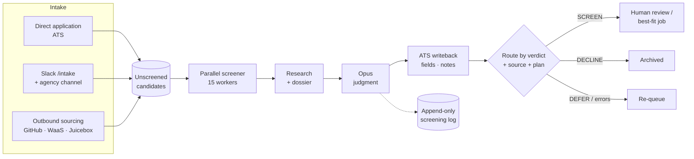
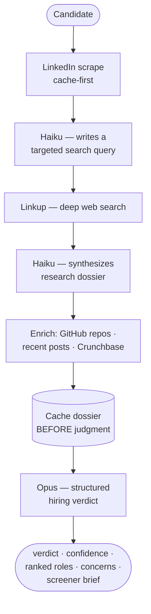

# AI Candidate Screening Pipeline

An agentic recruiting pipeline that sources, researches, and screens engineering
candidates end-to-end using Claude. It pulls candidates from an applicant tracking
system (ATS), builds a research dossier on each one from public data, runs a
structured hiring-judgment prompt, and writes the verdict back to the ATS with
plan-aware stage routing — all in parallel, with crash recovery and idempotent
writebacks.

Built and run in production to screen thousands of candidates across ~13 open roles.

> **Note:** This is a sanitized portfolio version. All candidate data, API keys,
> and organization-specific identifiers (ATS job IDs, Slack channel IDs, internal
> source records) have been removed or replaced with `REPLACE_WITH_*` placeholders.
> A few proprietary outreach/sequencing modules are referenced but intentionally
> not included.

---

## What it does



For each candidate the pipeline runs a multi-step agentic research-then-judge flow:

1. **LinkedIn scrape** — pull the public profile (cache-first).
2. **Smart query generation** — Claude Haiku writes a targeted web-search query from the profile.
3. **Web research** — deep search via Linkup for signals not on LinkedIn.
4. **Dossier synthesis** — Haiku fuses LinkedIn + web results into a structured research dossier.
5. **Enrichment** — GitHub profile/top-repos, recent posts, and Crunchbase company data are merged in when available.
6. **Judgment** — Claude Opus renders a structured hiring verdict (`SCREEN` / `DEFER` / `DECLINE` / `INSUFFICIENT DATA`) with confidence, reasoning, concerns, and ranked best-fit roles.
7. **Writeback** — verdict + reasoning land on the ATS record as custom fields and a stage-tailored note; the candidate is routed to the correct stage based on verdict, source (inbound vs. outbound vs. referral), and the interview plan.

## Key engineering properties

- **Parallel** — up to 15 candidates screened concurrently with a thread pool.
- **Cache-first & cheap-to-resume** — the research dossier is cached *before* the
  expensive judgment call, so an Opus timeout never loses the ~$0.09 of research.
  Re-runs can reuse the dossier (`--opus-only`).
- **Crash recovery** — a file-based processing lock with TTL means a dead laptop
  mid-batch is recovered on the next run; nothing is screened twice.
- **Idempotent, durable writebacks** — failed ATS writes are queued and replayed
  with zero re-screening; permanently-gone candidates are dead-lettered, not retried forever.
- **Forward-only routing** — candidates never move backward through stages; the
  router is plan-aware (each interview plan owns its own stage IDs).
- **Append-only audit ledger** — every screening decision is logged for analysis,
  calibration, and reproducibility.

## How it works (per candidate)

The heart of the system is an agentic **research-then-judge** loop: cheap, fast
models gather and structure evidence, then a frontier model renders the judgment.



1. **Scrape** the candidate's public LinkedIn profile (served from cache on repeat runs).
2. **Generate a search query** — Haiku reads the profile and writes a targeted query for the gaps.
3. **Search the web** — Linkup returns signals that aren't on LinkedIn (talks, repos, press, founding stories).
4. **Synthesize a dossier** — Haiku fuses everything into one structured research document.
5. **Enrich** — GitHub top repos, recent posts, and Crunchbase company data are merged in when available.
6. **Cache the dossier** — written to disk *before* the expensive judgment call, so a crash never wastes the research.
7. **Judge** — Opus returns a structured verdict against the role rubric (see example below).

The dossier-before-judgment cache is what makes the whole thing cheap to re-run:
`--opus-only` replays just the judgment step on the cached research, so you can
iterate on the prompt without paying for research again.

## Example output

A judgment for a (fictional) candidate. The model always returns one flat JSON
object — verdict, an integer confidence, ranked best-fit roles, typed concerns,
and a ready-to-use screener brief:

```json
{
  "spark": "Solo-built and shipped an open-source multi-agent coding tool to 9k GitHub stars while a full-time backend engineer — sustained 0-to-1 building outside the day job.",
  "verdict": "SCREEN",
  "confidence_score": 4,
  "verdict_reason": "Strong independent-builder signal with real traction, but the production work is all inside one mid-size company. The call should test whether they can own ambiguous scope end-to-end, not just execute well-specified tickets.",
  "roles": [
    { "role": "AI Backend Engineer", "fit_reason": "Distributed-systems depth at work + agent-orchestration side project map directly to the agent-runtime surface area.", "level": "Senior" },
    { "role": "AI Product Engineer", "fit_reason": "Secondary — product instinct shows in the OSS tool, but no PM tenure to clear the 12-month gate.", "level": "Senior" }
  ],
  "concerns": [
    { "concern": "Only one full-time employer since graduation", "type": "TESTABLE", "detail": "Resolve on the call: ask for a decision they owned end-to-end under ambiguity." }
  ],
  "regret_test": "Significant — the combination of shipped OSS traction and backend depth is rare and would be costly to skip.",
  "screener_brief": {
    "open_with": "The 9k-star agent tool — what made them build it and keep maintaining it.",
    "hypotheses": [
      {
        "hypothesis": "Can own ambiguous scope, not just execute specs.",
        "question": "Tell me about something you shipped where nobody told you what to build.",
        "green_flag": "Drove a fuzzy problem to a shipped outcome with real users.",
        "red_flag": "Every example is a well-specified ticket handed down by a lead."
      }
    ],
    "watch_for": "Whether they talk about users and outcomes, or only about code and tickets."
  },
  "rejection_type": null,
  "nurture": null
}
```

Downstream, this verdict drives everything automatically: the `roles[0]` entry
("AI Backend Engineer") routes the application to the right job, `confidence_score`
4 routes an inbound candidate to human review, the custom fields and screener brief
are written onto the ATS record, and the whole decision is appended to the audit log.

## Repository layout

| Area | Files |
|------|-------|
| **Entry point** | `screen_batch.py` — orchestrates batches, parallel workers, logging |
| **Core agentic flow** | `pipeline.py` — research → dossier → enrichment → Opus judgment |
| **ATS integration** | `ashby_bridge.py` — pull, push, stage routing, custom fields, dedup, durable writeback |
| **Research / enrichment** | `apify_linkedin.py`, `apify_posts.py`, `apify_crunchbase.py`, `linkedin_discovery.py` |
| **Sourcing** | `github_sourcer.py`, `waas_sourcer.py`, `juicebox_query_optimizer.py`, `push_to_ashby.py` |
| **Intake** | `slack_intake.py` — `/intake` slash command + agency-channel auto-monitor (Socket Mode) |
| **Judgment prompt** | `prompts/opus_body.md` — the structured hiring-evaluation prompt |
| **Evaluation harness** | `eval/eval_prompt.py` — offline replay of cached dossiers to compare prompt versions |
| **Feedback loop** | `pull_hm_feedback.py` — pulls hiring-manager notes to calibrate the prompt |
| **Utilities** | `csv_bridge.py`, `json_repair.py`, `pre_screener.py`, `movability.py`, `check_unscreened.py` |

## The `/screen` command

`.claude/skills/screen/SKILL.md` is a [Claude Code](https://claude.com/claude-code)
slash command that wraps the batch screener: it finds the latest candidate CSV,
confirms it with the user, runs the pipeline, and summarizes the results.

## Setup

```bash
pip install -r requirements.txt        # only slack-bolt; the rest is stdlib + raw HTTPS
cp .env.example .env                    # fill in your API keys
# replace the REPLACE_WITH_* placeholders in ashby_bridge.py / slack_intake.py / push_to_ashby.py
#   with your own ATS job/stage/actor IDs and Slack channel IDs
```

## Usage

```bash
# Screen a batch from a CSV export
python3 screen_batch.py

# Re-run only the judgment step on already-researched candidates (reuses cached dossiers)
python3 screen_batch.py --opus-only

# Count unscreened candidates for active roles (no screening)
python3 check_unscreened.py --count

# Source candidates from GitHub into the ATS
python3 github_sourcer.py --language TypeScript --location "San Francisco" \
  --min-stars 50 --require-linkedin --output sourced.csv
python3 push_to_ashby.py sourced.csv --source "Outbound - Github Sourced" --job "Frontend Engineer"

# Offline prompt evaluation (no ATS changes)
python3 eval/eval_prompt.py --since 2026-04-16 --prompt prompts/opus_body.md
```

## Tech

Python 3 · Claude (Opus for judgment, Haiku for research) via raw HTTPS · Apify
(LinkedIn / posts / Crunchbase) · Linkup (web search) · GitHub API · Ashby ATS API ·
Slack Bolt (Socket Mode).

## License

MIT — see [LICENSE](LICENSE).
